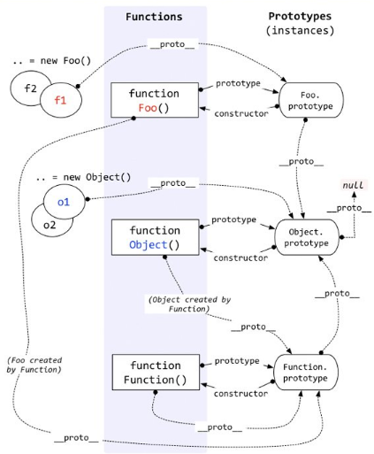

# 原型链 #
## 原型链示意图 ##

## 要点 ##
1. 原型链指的是由实例的`_proto_`属性构成的链
2. Foo.prototype = Object.prototype
3. Object.prototype.prototype = null
## instanceof ##
语法：`object instanceof constructor`   
`object`：要检测对象  
`constructor`：某个构造函数  
解释：`instanceof`的作用是在原型链上寻找`constructor.prototype`，如果找到了，返回True，否则返回False
